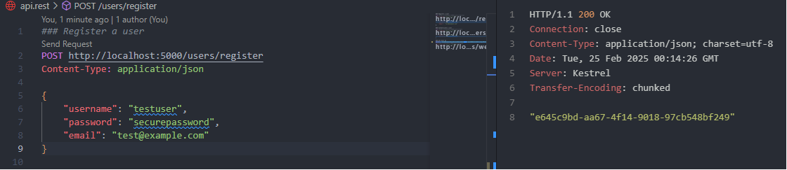
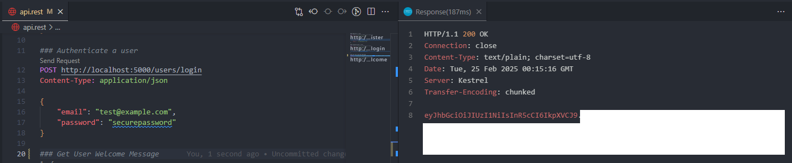
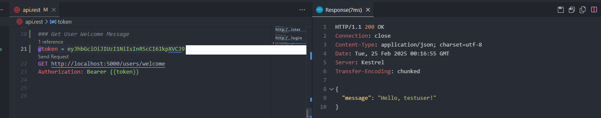

# How to run app

## Start application

```
docker-compose up
```

## Clear environment 

```
docker-compose down --rmi all --remove-orphans
```

## App URL

App should be running at: http://localhost:5000/swagger/index.html

Use api.rest file to create a user, log to get JWT and get welcome message for user

### Register new User


### Login User


### Welcome User

replace `PUT_TOKEN_VALUE_HERE` with the token value from login endpoint call



## how to run migrations (using at folder path /src):

add new migration
```
dotnet ef migrations add MIGRATION_NAME -p Infrastructure/Infrastructure.csproj -s Web.Api/Web.Api.csproj -o Database/Migrations
```

apply migrations:

```
dotnet ef database update -p Infrastructure/Infrastructure.csproj -s Web.Api/Web.Api.csproj
```